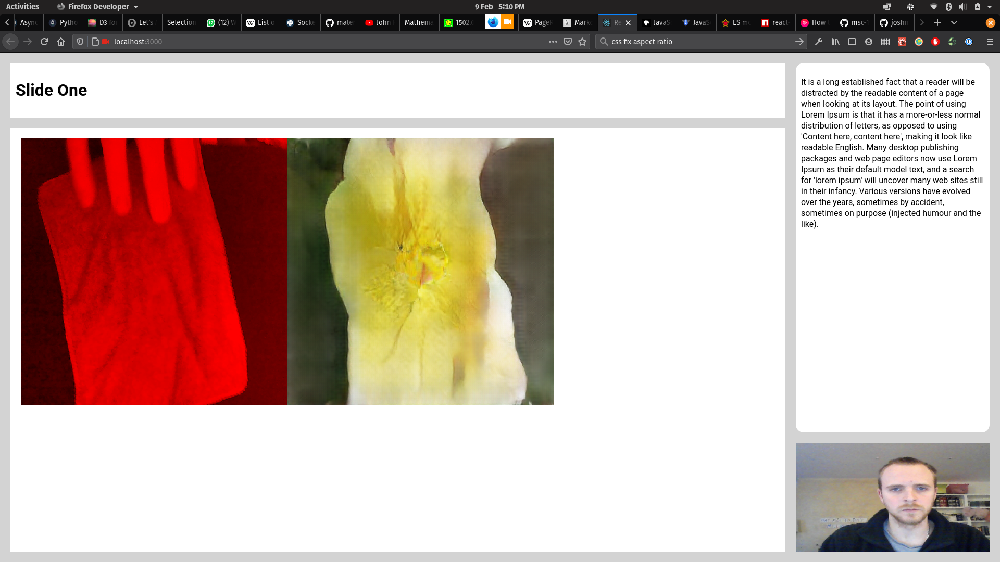

## React-Presentation

This was originally made as a solution to teaching online via some software called Blackboard which is used in higher education. I found it frustrating that you can _either_ share your webcam _or_ your screen. Being able to see the presenter during a presentation makes the whole experience much more enjoyable, IMO, so this was an answer to that problem.

The webcam input is run through a WebGL layer to allow me to mess with it if I want to.

It would be nice one day to have theme presets, but at the moment it's all hard coded.
