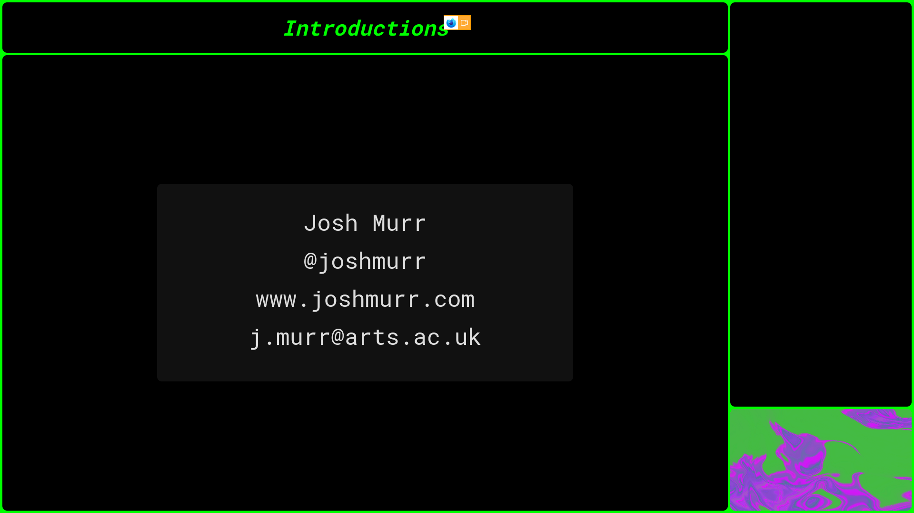

## React-Presentation

As it stands, to present online using Blackboard, I'm overlaying webcam footage over a application capture in OBS, streaming this to another window (I think OBS calls it a _projection_) and then telling Blackboard to share that window.. The reasoning behind this is to cut out the middle man and just share straight to Blackboard.

I'm going to the effort to run the webcam footage through a WebGL program just so I can mess with it in a shader if I want to. Maybe have a blur/pixelate filter if I'm away-from-keyboard.

This is very much for personal use so the code is a bit of a mess.
